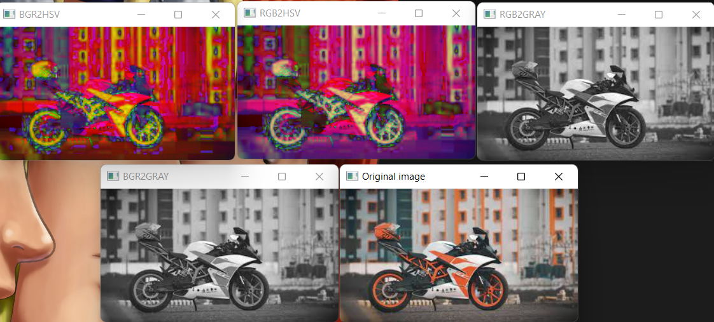
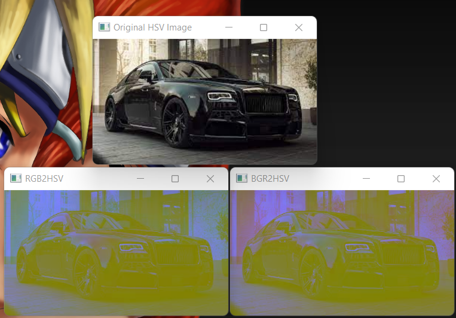
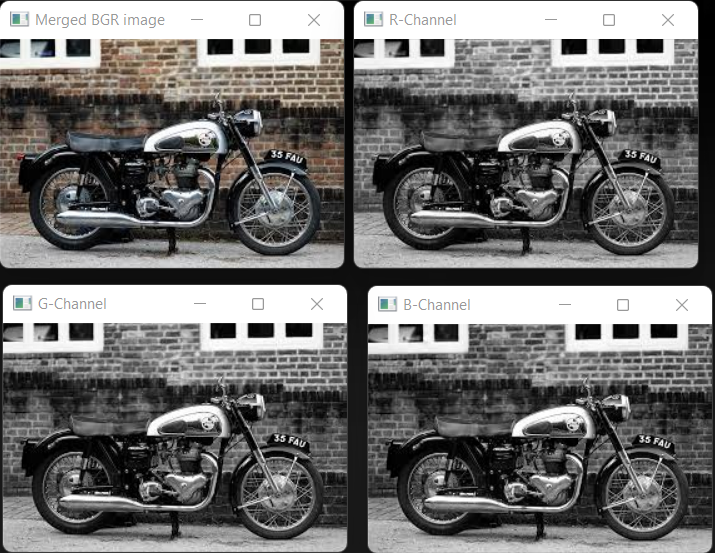
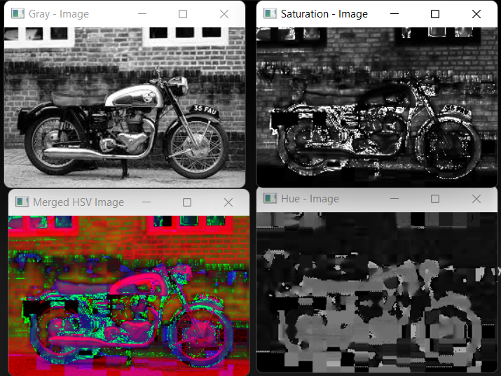

# Color Conversion
## AIM
To perform the color conversion between RGB, BGR, HSV, and YCbCr color models.

## Software Required:
Anaconda - Python 3.7
## Algorithm:
### Step1:
<br>

### Step2:
<br>

### Step3:
<br>

### Step4:
<br>

### Step5:
<br>

## Program:
```python
# Developed By:P.Siva Naga Nithin
# Register Number: 212221240037
# i) Convert BGR and RGB to HSV and GRAY
bikeImage = cv2.imread('bike.jpg')
cv2.imshow('Original Image',bikeImage)
hsvImage = cv2.cvtColor(bikeImage,cv2.COLOR_BGR2HSV)
cv2.imshow('BGR2HSV',hsvImage)
hsvImage1=cv2.cvtColor(bikeImage,cv2.COLOR_RGB2HSV)
cv2.imshow('RGB2HSV',hsvImage1)
grayImage = cv2.cvtColor(bikeImage,cv2.COLOR_BGR2GRAY)
cv2.imshow('BGR2GRAY',grayImage)
grayImage1 = cv2.cvtColor(bikeImage,cv2.COLOR_RGB2HSV)
cv2.imshow('RGB2GRAY',grayImage1)
cv2.waitKey(0)
cv2.destroyAllWindows()


# ii)Convert HSV to RGB and BGR
import cv2
enifieldHSVImage = cv2.imread('enifield.jpg')
cv2.imshow('Original HSV Image',enifieldHSVImage)
RGBImage = cv2.cvtColor(enifieldHSVImage,cv2.COLOR_HSV2RGB)
cv2.imshow('BGR2HSV',RGBImage)
BGRImage=cv2.cvtColor(enifieldHSVImage,cv2.COLOR_HSV2BGR)
cv2.imshow('RGB2HSV',BGRImage)
cv2.waitKey(0)
cv2.destroyAllWindows()


# iii)Convert RGB and BGR to YCrCb
import cv2
image = cv2.imread('rolls.jpg')
hsv = cv2.cvtColor(image,cv2.COLOR_BGR2HSV)
h,s,v = cv2.split(hsv)
cv2.imshow('Hue - Image',h)
cv2.imshow('Saturation - Image',s)
cv2.imshow('Gray - Image',v)
mergedHSV = cv2.merge((h,s,v))
cv2.imshow('Merged HSV Image',mergedHSV)
cv2.waitKey(0)
cv2.destroyAllWindows()


# iv)Split and Merge RGB Image
import cv2
image = cv2.imread('bulletjpg')
blue = image[:,:,0]
green = image[:,:,1]
red = image[:,:,2]
cv2.imshow('B-Channel',blue)
cv2.imshow('G-Channel',green)
cv2.imshow('R-Channel',red)
mergeBgr = cv2.merge((blue,green,red))
cv2.imshow('Merged BGR image',mergeBgr)
cv2.waitKey(0)
cv2.destroyAllWindows()


# v) Split and merge HSV Image
import cv2
image = cv2.imread('bullet1.jpg')
hsv = cv2.cvtColor(image,cv2.COLOR_BGR2HSV)
h,s,v = cv2.split(hsv)
cv2.imshow('Hue - Image',h)
cv2.imshow('Saturation - Image',s)
cv2.imshow('Gray - Image',v)
mergedHSV = cv2.merge((h,s,v))
cv2.imshow('Merged HSV Image',mergedHSV)
cv2.waitKey(0)
cv2.destroyAllWindows()


```
## Output:
### i) BGR and RGB to HSV and GRAY

### ii) HSV to RGB and BGR

### iii) RGB and BGR to YCrCb

### iv) Split and merge RGB Image


### v) Split and merge HSV Image


## Result:
Thus the color conversion was performed between RGB, HSV and YCbCr color models.
